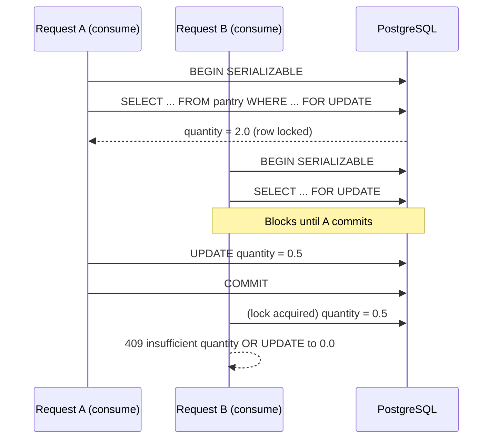
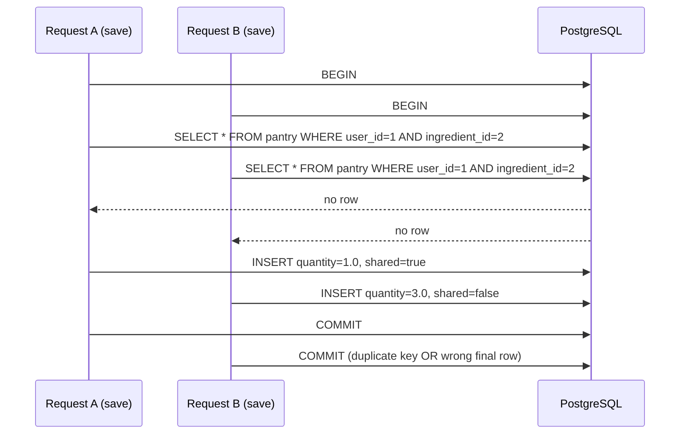

# Concurrency control in Food Graph API

This document describes three realistic concurrency hazards in our service, the database phenomena they would exhibit without protection, and what we implemented to preserve transaction isolation. Phenomena follow the definitions in [Database Concurrency and Isolation (Cal Poly)](https://observablehq.com/@calpoly-pierce/isolation-levels).

Implementation helpers live in `src/api/helpers.py` (`transactional()` with optional isolation levels). Write paths use `engine.begin()` or `transactional()`; read-mostly paths use `engine.connect()`.

---

## Case 1: Lost update when two cooks deduct the same pantry stock

**Endpoint:** `POST /recipes/{recipe_id}/consume`  
**Phenomenon without protection:** **Lost update**

Two roommates (or two tabs for the same user) cook the same recipe at the same time. Each transaction reads `pantry.quantity = 2.0`, subtracts `1.5`, and writes `0.5`. With no row locking, both reads happen before either write commits, so both writers store `0.5` even though the correct final balance is **−1.0** (or the second cook should fail).

### Sequence diagram (unprotected)

```mermaid
sequenceDiagram
    participant A as Request A (consume)
    participant B as Request B (consume)
    participant DB as PostgreSQL

    A->>DB: BEGIN
    B->>DB: BEGIN
    A->>DB: SELECT quantity FROM pantry WHERE user_id=2 AND ingredient_id=1
    B->>DB: SELECT quantity FROM pantry WHERE user_id=2 AND ingredient_id=1
    DB-->>A: quantity = 2.0
    DB-->>B: quantity = 2.0
    A->>DB: UPDATE pantry SET quantity = 0.5
    B->>DB: UPDATE pantry SET quantity = 0.5
    A->>DB: COMMIT
    B->>DB: COMMIT
    Note over DB: Final quantity is 0.5; one deduction was lost
```

### What we do

`consume_recipe` runs inside `transactional(..., isolation_level="SERIALIZABLE")` and locks each affected pantry row with `SELECT ... FOR UPDATE` before checking amounts and issuing `UPDATE`.

- **`FOR UPDATE`** blocks a second consumer from reading the balance until the first transaction finishes, preventing the interleaved read/read/write/write pattern above.
- **`SERIALIZABLE`** is appropriate here because we read multiple pantry rows and must commit or abort as a unit; a failed serializable transaction can be retried by the client.

### Sequence diagram (protected)



---

## Case 2: Non-repeatable read on a household shopping list while pantry changes

**Endpoint:** `GET /households/{household_id}/shopping-list`  
**Phenomenon without protection:** **Non-repeatable read** (and potentially **phantom read** if membership changes mid-request)

A client requests a shopping list. Mid-request, another member saves a shared ingredient. Without a stable snapshot, the handler could observe “rice is missing” in one sub-query and “rice is present” in another, returning inconsistent `have` / `missing` / `coverage_pct`.

### Sequence diagram (unprotected, default READ COMMITTED)

```mermaid
sequenceDiagram
    participant C as Client (shopping-list)
    participant M as Member (save ingredient)
    participant DB as PostgreSQL

    C->>DB: BEGIN (READ COMMITTED)
    C->>DB: Query recipe ingredients for recipe 4
    M->>DB: BEGIN
    M->>DB: UPSERT pantry (add rice, shared=true)
    M->>DB: COMMIT
    C->>DB: Query household pantry IDs
    DB-->>C: rice not in set (stale view vs reality)
    C->>DB: COMMIT
    Note over C: Response lists rice under missing; member already added it
```

### What we do

`household_shopping_list` uses `transactional(..., isolation_level="REPEATABLE READ")` so all reads inside the handler share one snapshot of committed data.

- **`REPEATABLE READ`** is the right tradeoff: we only read, we need a consistent pantry view for the diff, and we do not need the full conflict detection of `SERIALIZABLE` for this path.
- Membership changes during the request could still appear as a phantom at stricter levels; for V4 we document that shopping-list consistency is pantry-focused. Household joins are infrequent compared to pantry writes.

---

## Case 3: Concurrent upserts to the same pantry row (write skew / last writer wins)

**Endpoint:** `POST /ingredients/save`  
**Phenomenon without protection:** **Lost update** / **write skew** on the same logical row

Two requests upsert the same `(user_id, ingredient_id)` with different `quantity` or `is_shared_with_household` values. Plain read-then-write would leave whichever commit lands last, silently discarding the other client’s fields.

### Sequence diagram (unprotected read-modify-write)



### What we do

`save_ingredient` uses a single-statement PostgreSQL upsert inside `engine.begin()`:

```sql
INSERT INTO pantry (...) VALUES (...)
ON CONFLICT ON CONSTRAINT pantry_pkey DO UPDATE SET ...
```

- The **atomic upsert** lets the database serialize conflicting writers on the primary key `(user_id, ingredient_id)` instead of application-level read/modify/write.
- **`updated_at = NOW()`** on conflict gives a clear last-write timestamp for auditing.
- Default isolation **`READ COMMITTED`** is sufficient because the conflict target is one row and Postgres row-level locking during `ON CONFLICT` prevents torn inserts.

For quantity *deduction* (not blind overwrite), clients should use `POST /recipes/{recipe_id}/consume`, which uses row locks as in Case 1.

---

## Summary

| Case | Endpoint | Phenomenon | Isolation / mechanism |
|------|----------|------------|------------------------|
| 1 | `POST /recipes/{id}/consume` | Lost update | `SERIALIZABLE` + `SELECT ... FOR UPDATE` |
| 2 | `GET /households/{id}/shopping-list` | Non-repeatable read | `REPEATABLE READ` snapshot |
| 3 | `POST /ingredients/save` | Lost update / write skew | Single-statement `ON CONFLICT DO UPDATE` in a transaction |
